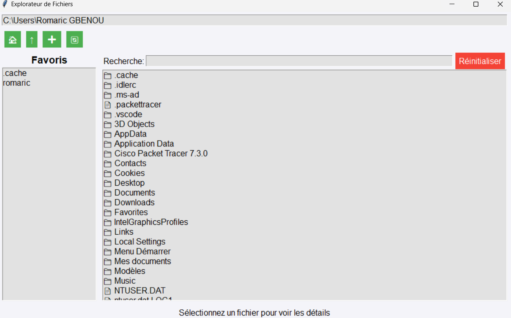
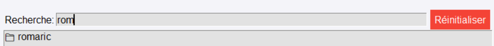
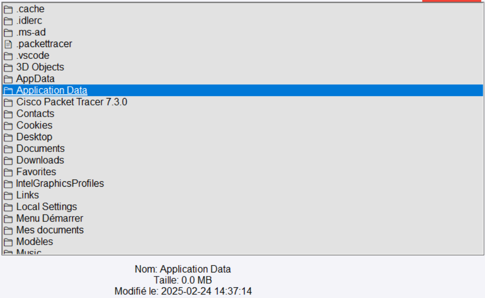
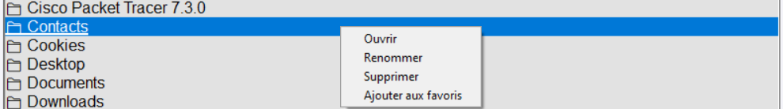
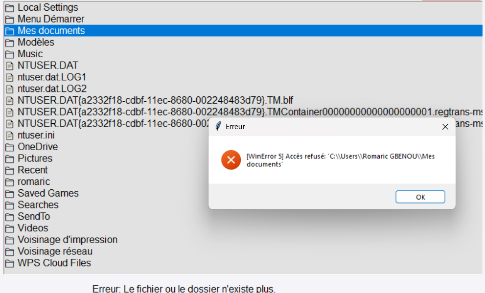
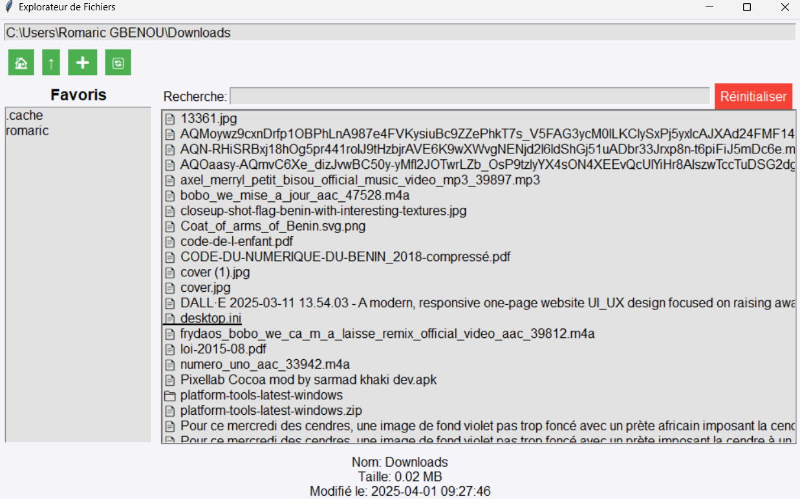

# Explorateur de Fichiers Python avec Tkinter

Un explorateur de fichiers simple développé en Python utilisant Tkinter. Ce projet permet de naviguer dans les répertoires, de rechercher des fichiers, de créer des dossiers, d'ajouter des éléments aux favoris, et bien plus.

---

### Membres du groupe
1- GBENOU Romaric

2- HEDJI G. Abed

## Table des matières

1. [Installation](#installation)
2. [Fonctionnalités](#fonctionnalités)
3. [Screenshots](#screenshots)
4. [Problèmes rencontrés et solutions](#problèmes-rencontrés-et-solutions)

---

## Installation

### Prérequis
- Python 3.x
- Tkinter (souvent inclus avec Python, sinon vous pouvez l'installer via `sudo apt-get install python3-tk` sur Ubuntu)
  
### Installation du projet
1. Clonez ce repository :
   ```bash
   git clone https://github.com/votre-nom/utilisateur.git
   ```
2. Accédez au répertoire du projet :
   ```bash
   cd explorateur-de-fichiers
   ```
3. Exécutez le fichier Python :
   ```bash
   python main.py
   ```

---

## Fonctionnalités

- **Navigation dans les fichiers et répertoires** : Vous pouvez naviguer dans vos répertoires personnels, remonter dans les dossiers parent ou revenir à la racine de votre répertoire.
- **Favoris** : Ajoutez vos répertoires ou fichiers les plus utilisés aux favoris pour y accéder rapidement.
- **Recherche de fichiers** : Un champ de recherche vous permet de filtrer les fichiers selon un terme de recherche.
- **Affichage des détails** : Affiche des informations détaillées sur chaque fichier sélectionné (nom, taille, date de modification).
- **Gestion des fichiers** : Renommez, supprimez ou ouvrez des fichiers et répertoires.

---

## Screenshots

### 1. Interface principale de l'explorateur de fichiers


### 2. Fenêtre de recherche


### 3. Affichage des détails d'un fichier/dossier


### 4. Favoris


### 5. Menu contextuel (clic droit)


### 6. Message d’erreur


### 7. Dossiers et fichiers dans l'explorateur


---

## Problèmes rencontrés et solutions

### 1. Problème : **Erreur lors de l'accès à certains fichiers/dossiers**  
**Description** : Certains fichiers ou dossiers n'étaient pas accessibles à cause des permissions de fichier. Lorsqu'un utilisateur essayait d'ouvrir un fichier protégé, une erreur de permission se produisait.  
**Solution** : Nous avons ajouté une gestion des exceptions autour des accès de fichiers pour gérer les erreurs de permission et afficher des messages d'erreur clairs.

### 2. Problème : **Difficulté à rafraîchir la liste des fichiers après modification**  
**Description** : Lorsqu'un fichier était modifié en dehors de l'application (par exemple, supprimé ou renommé), la liste des fichiers ne se mettait pas automatiquement à jour.  
**Solution** : Nous avons ajouté une méthode `refresh_list` qui recharge la liste des fichiers après une modification pour assurer que l'affichage soit toujours à jour.

### 3. Problème : **Problème de gestion des favoris**  
**Description** : Il y avait des incohérences dans la gestion des favoris, notamment des favoris qui disparaissaient après une fermeture de l'application.  
**Solution** : Nous avons intégré un fichier JSON pour sauvegarder les favoris de manière persistante entre les sessions.

### 4. Problème : **Mise à jour de l'affichage du chemin de répertoire**  
**Description** : Le chemin du répertoire n'était pas toujours correctement mis à jour lors de la navigation.  
**Solution** : Nous avons ajouté une méthode `update_path_display` pour mettre à jour en temps réel le champ de texte affichant le chemin actuel.

---


